# 🚀 Serverless Event Registration System on AWS

## 📌 Project Overview

This project is a fully serverless event registration platform built using AWS cloud services.

The application allows users to:

- View available events
- Register for events
- Prevent seat overbooking
- Receive email confirmation automatically after registration

The system is designed using an event-driven serverless architecture with AWS Lambda, API Gateway, DynamoDB, SNS, SES, S3, CloudFront, and CloudWatch.

This project demonstrates practical cloud-native application development concepts including:

- Serverless computing
- Event-driven architecture
- REST API development
- Infrastructure integration
- Monitoring and logging
- Static website hosting
- Cloud-based notification systems

---

# 🏗️ Architecture Diagram

```text
                        ┌──────────────────────┐
                        │      End Users       │
                        └──────────┬───────────┘
                                   │
                                   ▼
                    ┌────────────────────────────┐
                    │ CloudFront Distribution    │
                    └──────────┬─────────────────┘
                               │
                               ▼
                    ┌────────────────────────────┐
                    │ S3 Static Website Bucket   │
                    └──────────┬─────────────────┘
                               │
                               ▼
                    ┌────────────────────────────┐
                    │ API Gateway REST API       │
                    └───────┬─────────┬──────────┘
                            │         │
                GET /events │         │ POST /register
                            ▼         ▼
                ┌────────────────┐  ┌─────────────────────┐
                │ getEvents      │  │ registerForEvent    │
                │ Lambda         │  │ Lambda              │
                └──────┬─────────┘  └─────────┬──────────┘
                       │                      │
                       ▼                      ▼
               ┌───────────────┐      ┌────────────────┐
               │ Events Table  │      │ Registrations  │
               │ DynamoDB      │      │ DynamoDB       │
               └───────────────┘      └────────────────┘
                                              │
                                              ▼
                                  ┌────────────────────┐
                                  │ SNS Topic          │
                                  └─────────┬──────────┘
                                            │
                                            ▼
                                ┌─────────────────────────┐
                                │ sendConfirmationEmail   │
                                │ Lambda                  │
                                └──────────┬──────────────┘
                                           │
                                           ▼
                                   ┌──────────────┐
                                   │ Amazon SES   │
                                   └──────────────┘
```

---

# ☁️ AWS Services Used

| Service | Purpose |
|---|---|
| AWS Lambda | Backend serverless functions |
| Amazon API Gateway | REST API endpoints |
| Amazon DynamoDB | Event and registration storage |
| Amazon SNS | Event-driven notifications |
| Amazon SES | Sending confirmation emails |
| Amazon S3 | Frontend static website hosting |
| Amazon CloudFront | CDN delivery for frontend |
| Amazon CloudWatch | Monitoring, logs, and alarms |

---

# 📂 Project Structure

```text
SERVERLESS-EVENT-REGISTRATION/
│
├── screenshots/
├── getEvents.py
├── registerForEvent.py
├── sendConfirmationEmail.py
├── index.html
└── README.md
```

---

# 🔁 Application Workflow

## 1. Load Events

- Frontend sends a GET request to API Gateway
- API Gateway invokes `getEvents` Lambda
- Lambda fetches event data from DynamoDB
- Events are returned to the frontend

## 2. Register for Event

- User submits registration form
- Frontend sends POST request to API Gateway
- API Gateway invokes `registerForEvent` Lambda
- Lambda:
  - validates request
  - reserves seat atomically
  - stores registration
  - publishes SNS notification

## 3. Send Confirmation Email

- SNS triggers `sendConfirmationEmail` Lambda
- Lambda sends confirmation email using Amazon SES

---

# 🛠️ DynamoDB Tables

## Events Table

Stores event details.

### Sample Attributes

| Attribute | Description |
|---|---|
| eventId | Unique event ID |
| title | Event title |
| date | Event date |
| totalSeats | Total capacity |
| availableSeats | Remaining seats |

### Screenshot

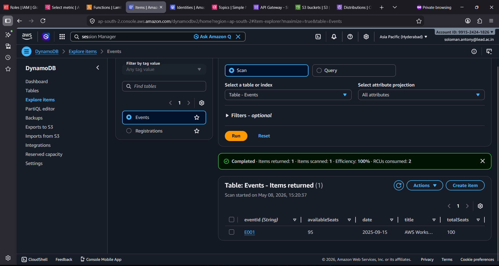

---

## Registrations Table

Stores user registration records.

### Sample Attributes

| Attribute | Description |
|---|---|
| registrationId | Unique registration ID |
| eventId | Registered event |
| userName | User name |
| userEmail | User email |
| registeredAt | Registration timestamp |

### Screenshot

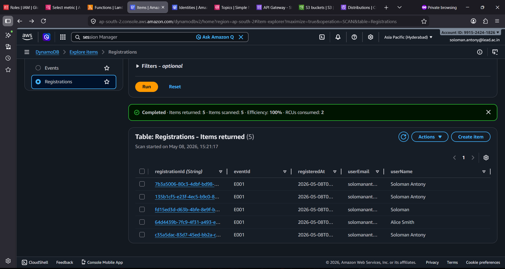

---

# ⚡ Lambda Functions

## 1. getEvents Lambda

This Lambda retrieves event data from the DynamoDB `Events` table.

### Features

- Fetches all events
- Returns JSON response
- Supports CORS

### Screenshot

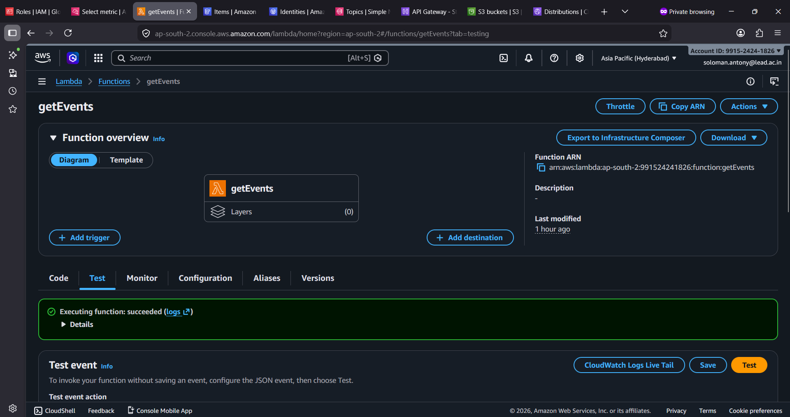

---

## 2. registerForEvent Lambda

This Lambda handles event registration logic.

### Features

- Accepts registration requests
- Prevents overbooking using conditional updates
- Stores registration details
- Publishes SNS notification

### Screenshot

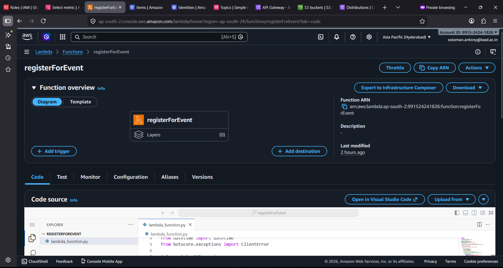

---

## 3. sendConfirmationEmail Lambda

This Lambda sends email confirmations using Amazon SES.

### Features

- Triggered by SNS
- Generates email content
- Sends HTML and text email

### Screenshot

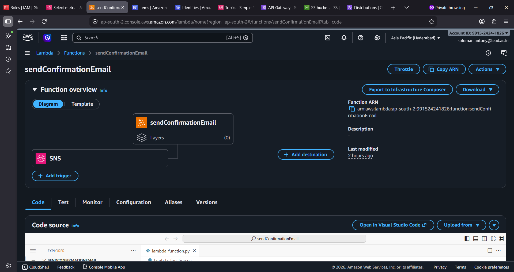

---

# 📡 Amazon SNS

Amazon SNS is used to trigger email notifications asynchronously.

### Workflow

- `registerForEvent` publishes message
- SNS topic receives event
- SNS triggers email Lambda

### SNS Topic Screenshot

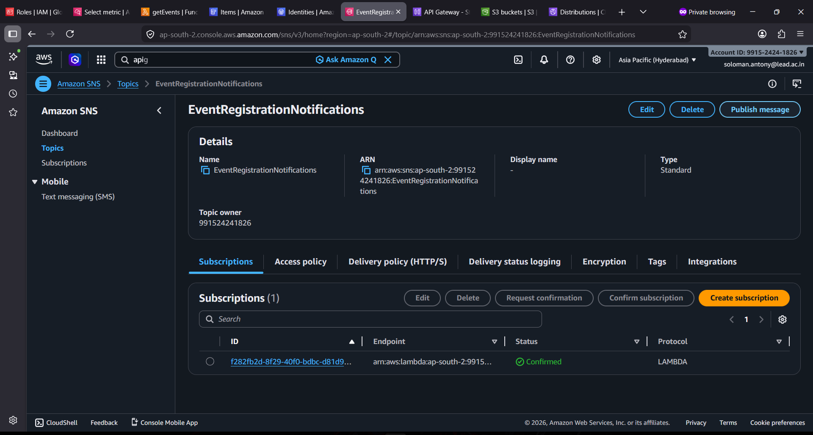

### SNS Subscription Screenshot

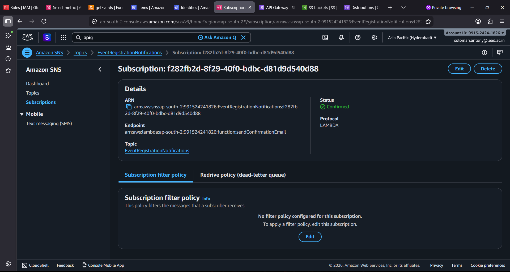

---

# ✉️ Amazon SES

Amazon SES is used for sending registration confirmation emails.

### Features

- Verified sender identity
- Sandbox testing support
- HTML email formatting

### Screenshot

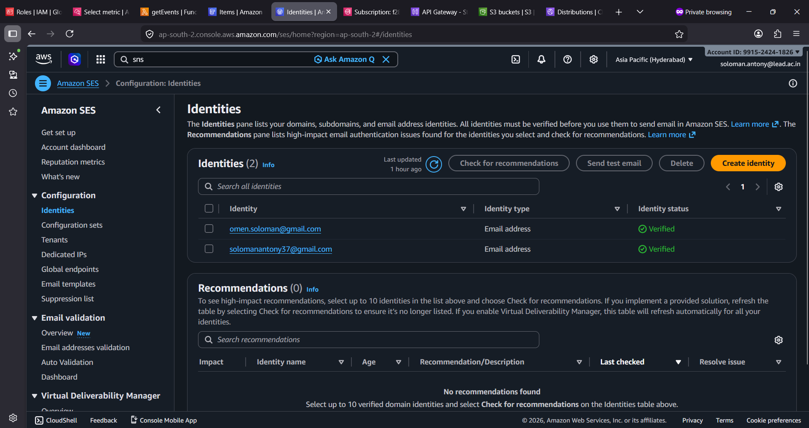

---

# 🌐 API Gateway REST API

API Gateway exposes REST endpoints for the frontend.

## Endpoints

| Method | Endpoint | Purpose |
|---|---|---|
| GET | /events | Fetch available events |
| POST | /register | Register user for event |

---

## GET /events

### Screenshot

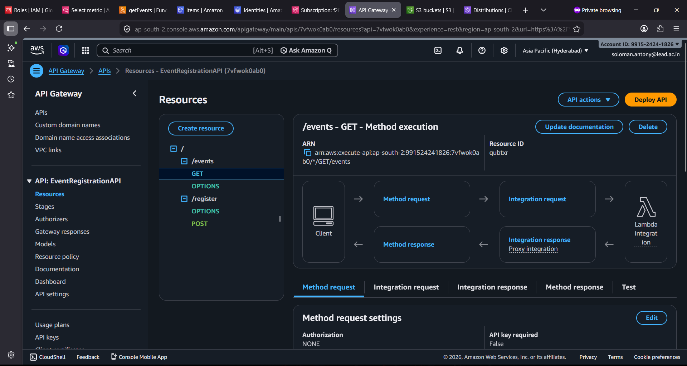

---

## POST /register

### Screenshot

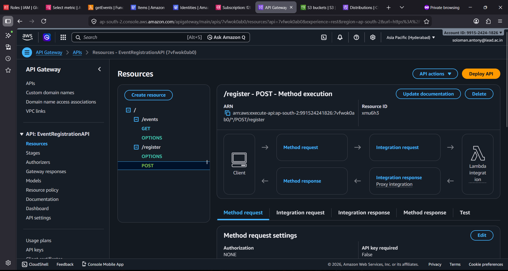

---

## API Test Result

### Screenshot

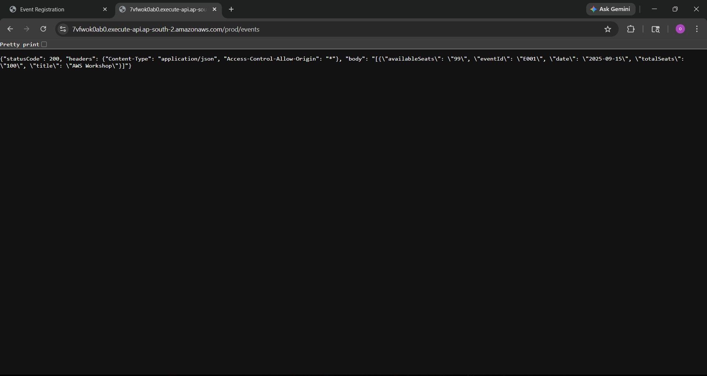

---

# 🖥️ Frontend Deployment

The frontend is hosted as a static website in Amazon S3 and distributed globally using CloudFront.

### Features

- Responsive UI
- Fetch API integration
- Registration form
- Success/error handling

### Frontend Screenshot

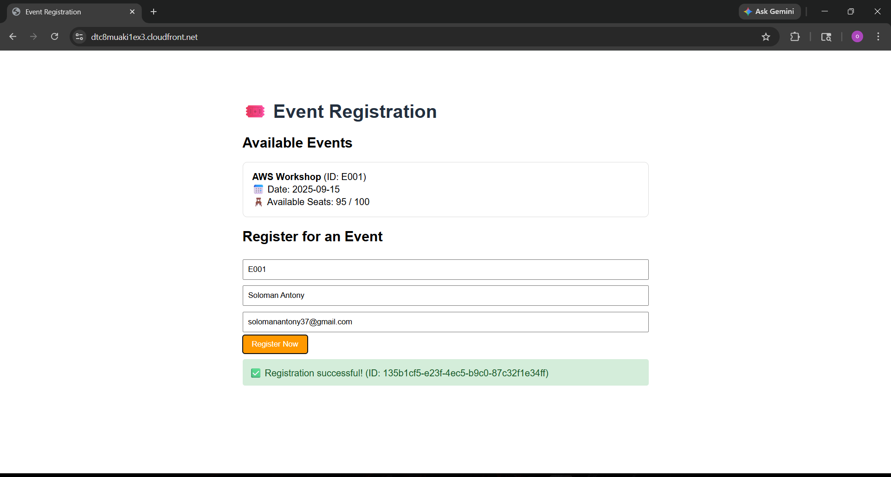

---

# 🪣 Amazon S3 Hosting

Amazon S3 hosts the frontend static files.

### Screenshot

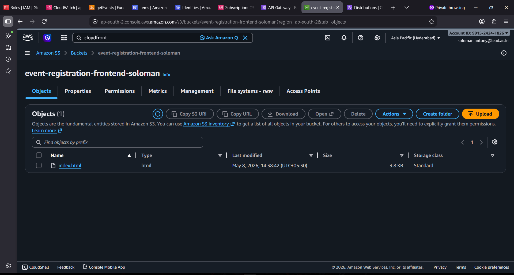

---

# 🌍 CloudFront Distribution

CloudFront provides global CDN delivery for the frontend.

### Benefits

- Low latency delivery
- HTTPS support
- Global edge caching

### Screenshot

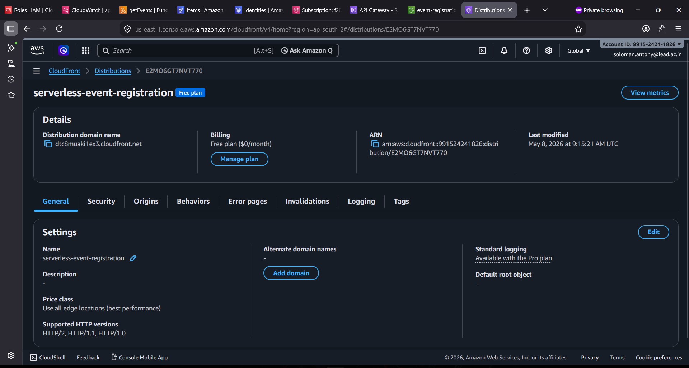

---

# 📊 CloudWatch Monitoring

CloudWatch is used for:

- Lambda execution logs
- Error monitoring
- Alarm notifications

---

## CloudWatch Logs

### getEvents Logs

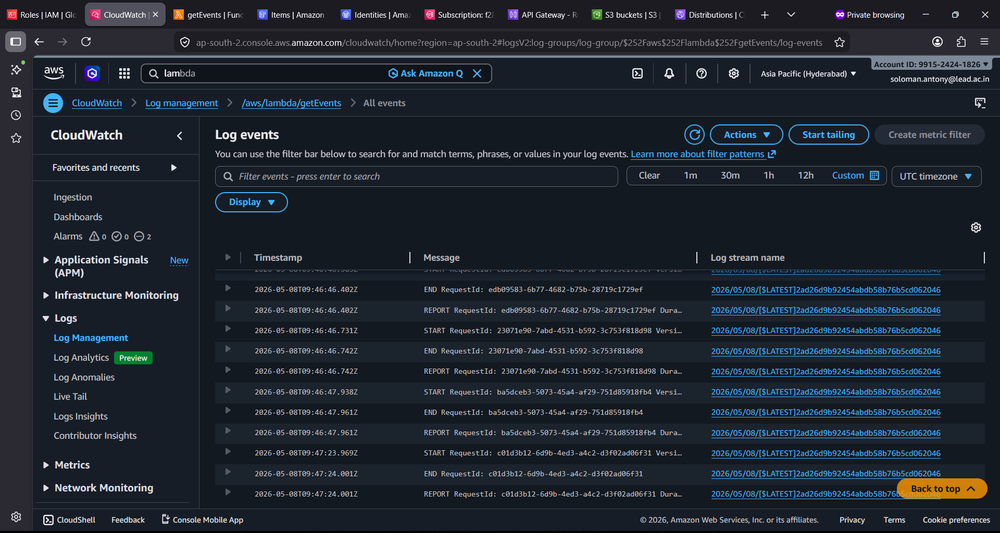

### registerForEvent Logs

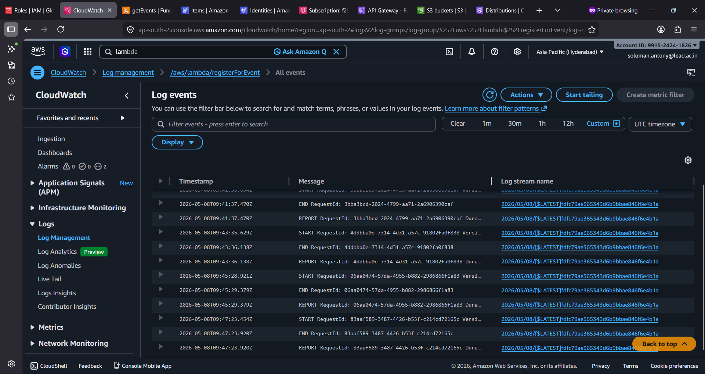

### sendConfirmationEmail Logs


---

## CloudWatch Alarms

### getEvents Alarm

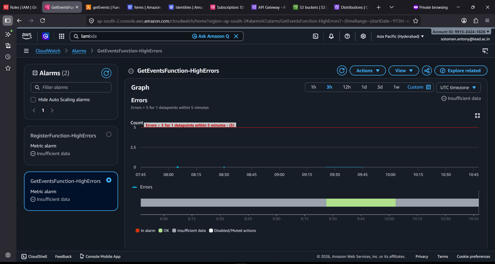

### registerForEvent Alarm

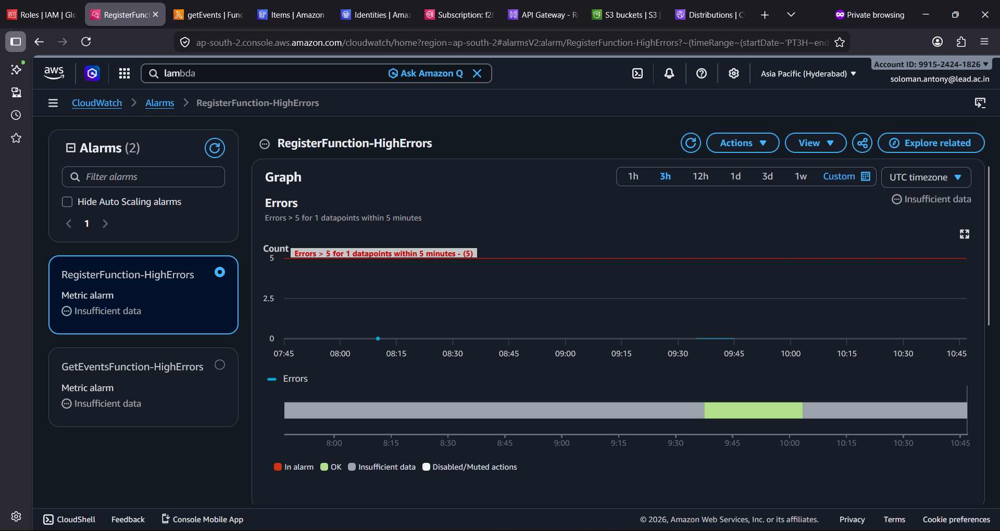

---

# 🔐 Security Features

- IAM roles for Lambda execution
- API Gateway integration permissions
- SES verified identities
- CORS configuration
- Controlled DynamoDB access

---

# 🧠 Key Concepts Demonstrated

- Serverless architecture
- Event-driven workflows
- REST APIs
- DynamoDB integration
- SNS pub/sub architecture
- SES email delivery
- Cloud monitoring and alarms
- Static website hosting
- CDN deployment

---

# 🚀 Challenges Faced

During development, several challenges were encountered and resolved:

- DynamoDB Decimal JSON serialization issues
- API Gateway Lambda proxy integration configuration
- CORS configuration errors
- SES sandbox verification requirements
- CloudFront deployment delays
- SNS to Lambda integration setup

These challenges improved understanding of AWS service integration and troubleshooting.

---

# 📈 Learning Outcomes

This project helped in understanding:

- Practical serverless application development
- Event-driven cloud architecture
- AWS service integration
- API design and deployment
- Monitoring and debugging cloud applications
- Secure cloud resource management

---

# ✅ Project Status

✔ Backend APIs implemented

✔ DynamoDB integration completed

✔ SNS + SES email workflow completed

✔ Frontend deployed on S3 + CloudFront

✔ Monitoring and alarms configured

✔ End-to-end event registration workflow working successfully

---

# 👨‍💻 Author

**Soloman Antony**

Master's Student – Computer Science

Cloud & DevOps Enthusiast

